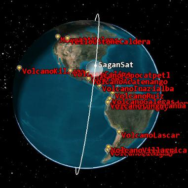
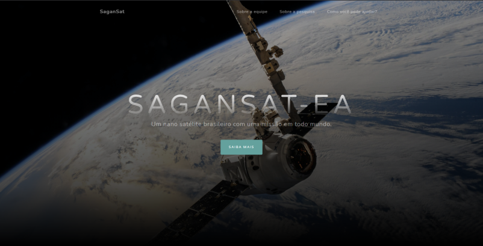

[![Contributors][contributors-shield]][contributors-url]
[![Forks][forks-shield]][forks-url]
[![Stargazers][stars-shield]][stars-url]
[![Issues][issues-shield]][issues-url]
[![MIT License][license-shield]][license-url]
[![LinkedIn][linkedin-shield]][linkedin-url]

<br />
<p align="center">
  <a href="https://github.com/https://github.com/SaganSat-EA/website">
    
  </a>

  <h3 align="center">SaganSat - Website</h3>

  <p align="center">
    The website code of SaganSat
    <br />
    <a href="https://github.com/https://github.com/SaganSat-EA/website/tree/main/docs"><strong>Explore the docs »</strong></a>
    <br />
    <br />
    <a href="https://github.com/https://github.com/SaganSat-EA/website/issues">Report Bug</a>
    ·
    <a href="https://github.com/https://github.com/SaganSat-EA/website/issues">Request Feature</a>
  </p>
</p>

<details open="open">
  <summary>Table of Contents</summary>
  <ol>
    <li>
      <a href="#about-the-project">About The Project</a>
      <ul>
        <li><a href="#built-with">Built With</a></li>
      </ul>
    </li>
    <li>
      <a href="#getting-started">Getting Started</a>
      <ul>
        <li><a href="#prerequisites">Prerequisites</a></li>
        <li><a href="#installation">Installation</a></li>
      </ul>
    </li>
    <li><a href="#usage">Usage</a></li>
    <li><a href="#roadmap">Roadmap</a></li>
    <li><a href="#contributing">Contributing</a></li>
    <li><a href="#license">License</a></li>
    <li><a href="#contact">Contact</a></li>
  </ol>
</details>

## About The Project

In this repository you will find the source code of the website developed for SaganSat-EA.

### Built With

* [NextJS](https://nextjs.org/)

## Getting Started

To get a local copy up and running follow these simple example steps.

### Prerequisites

* NodeJS

### Installation

1. Clone the repo
   ```sh
   git clone https://github.com/https://github.com/SaganSat-EA/website.git
   ```
2. Install packages
   ```sh
   cd sagansat && yarn
   ```
3. Start server
   ```sh
   yarn start
   ```

## Usage


<p align="center">
  <a href="https://github.com/https://github.com/SaganSat-EA/website">
    
  </a>
  Visit sagan.com and browse!
</p>

## Roadmap

See the [open issues](https://github.com/https://github.com/SaganSat-EA/website/issues) for a list of proposed features (and known issues).

## Contributing

Contributions are what make the open source community such an amazing place to be learn, inspire, and create. Any contributions you make are **greatly appreciated**.

1. Fork the Project
2. Create your Feature Branch (`git checkout -b feature/AmazingFeature`)
3. Commit your Changes (`git commit -m 'Add some AmazingFeature'`)
4. Push to the Branch (`git push origin feature/AmazingFeature`)
5. Open a Pull Request

## License

Distributed under the MIT License. See `LICENSE` for more information.

## Contact

Matheus Nobre Gomes - matt-gomes@live.com

Project Link: [https://github.com/https://github.com/SaganSat-EA/website](https://github.com/https://github.com/SaganSat-EA/website)

<!-- MARKDOWN LINKS & IMAGES -->
<!-- https://www.markdownguide.org/basic-syntax/#reference-style-links -->
[contributors-shield]: https://img.shields.io/github/contributors/https://github.com/SaganSat-EA/website.svg?style=for-the-badge
[contributors-url]: https://github.com/https://github.com/SaganSat-EA/website/graphs/contributors
[forks-shield]: https://img.shields.io/github/forks/https://github.com/SaganSat-EA/website.svg?style=for-the-badge
[forks-url]: https://github.com/https://github.com/SaganSat-EA/website/network/members
[stars-shield]: https://img.shields.io/github/stars/https://github.com/SaganSat-EA/website.svg?style=for-the-badge
[stars-url]: https://github.com/https://github.com/SaganSat-EA/website/stargazers
[issues-shield]: https://img.shields.io/github/issues/https://github.com/SaganSat-EA/website.svg?style=for-the-badge
[issues-url]: https://github.com/https://github.com/SaganSat-EA/website/issues
[license-shield]: https://img.shields.io/github/license/https://github.com/SaganSat-EA/website.svg?style=for-the-badge
[license-url]: https://github.com/https://github.com/SaganSat-EA/website/blob/main/LICENSE.txt
[linkedin-shield]: https://img.shields.io/badge/-LinkedIn-black.svg?style=for-the-badge&logo=linkedin&colorB=555
[linkedin-url]: https://linkedin.com/in/mattnobre
[product-screenshot]: images/home.png
